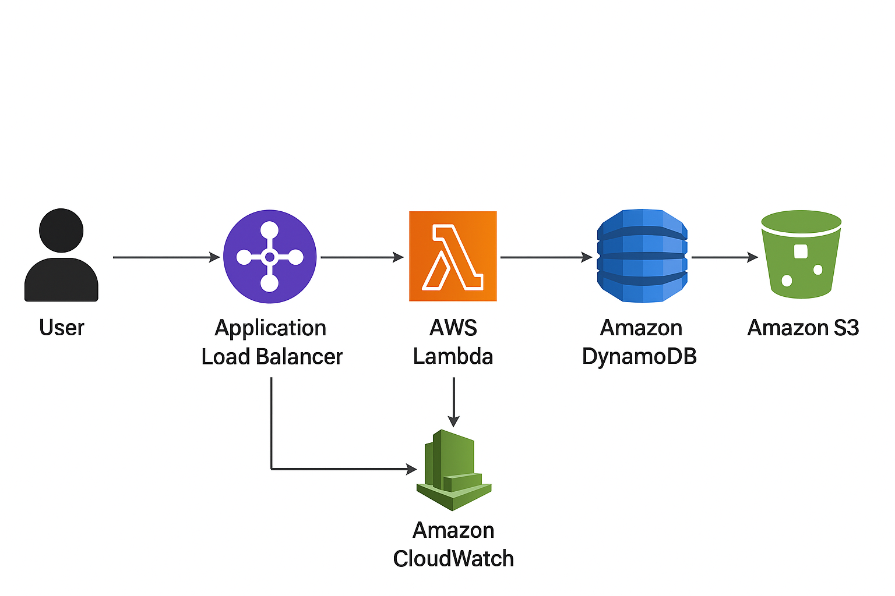

# Serverless REST API Project

## Overview
This project implements a serverless REST API using AWS Lambda, API Gateway, and DynamoDB. It allows CRUD operations for managing simple items.

## Architecture
- **API Gateway:** Exposes REST endpoints.
- **Lambda Functions:** Handles CRUD operations.
- **DynamoDB:** Stores items.
- **S3:** Hosts frontend HTML/JS.

## Architecture Diagram

## Setup
1. Install Serverless Framework: `npm install -g serverless`
2. Deploy: `serverless deploy`
3. Access API Gateway URL from deployment output.
4. Open `frontend/index.html` and update `apiUrl` with your API Gateway URL.

## AWS Services Used
- AWS Lambda
- Amazon API Gateway
- Amazon DynamoDB
- Amazon S3
- IAM Roles
- CloudWatch Logs

## Features
- Create, read, update, delete items.
- Serverless, auto-scaling architecture.
- Frontend to list items dynamically.
